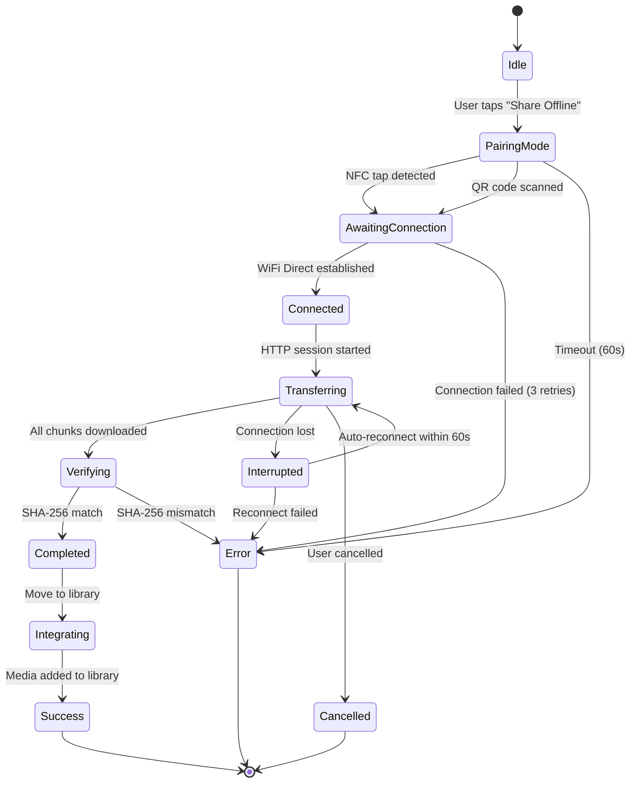

# Design Document - Transfert Média P2P Hors Ligne

## Overview

La fonctionnalité de transfert P2P hors ligne permet aux utilisateurs de CHILLERS de partager des médias téléchargés entre appareils mobiles sans connexion Internet. Le système utilise une architecture basée sur :

1. **Appairage rapide** via NFC (< 2s) ou QR Code comme fallback
2. **Connexion directe** via Wi-Fi Direct (Android) ou Hotspot Personnel (iOS)
3. **Transfert HTTP local** avec serveur éphémère servant des chunks de 1 MB
4. **Vérification d'intégrité** via SHA-256 hash comparison
5. **Intégration transparente** dans la bibliothèque média locale

Cette solution offre une expérience utilisateur premium similaire à AirDrop, avec une vitesse de transfert cible de 20-60 Mo/s et un temps de connexion inférieur à 15 secondes.

### Objectifs de Design

- **Simplicité**: Expérience one-tap pour l'utilisateur (NFC) ou one-scan (QR Code)
- **Fiabilité**: Taux de réussite > 95% avec reprise automatique en cas d'interruption
- **Performance**: Débit minimum 10 Mo/s, cible 20-60 Mo/s sur Wi-Fi Direct
- **Sécurité**: Connexion chiffrée (WPA2/WPA3), credentials éphémères, pas d'exposition de données
- **Cross-platform**: Support Android ↔ Android, iOS ↔ iOS, Android ↔ iOS

## Architecture

### System Design

Le système adopte une architecture peer-to-peer avec deux rôles distincts :

```
┌─────────────────────────────────────────────────────────────────┐
│                        SENDER DEVICE                             │
├─────────────────────────────────────────────────────────────────┤
│                                                                  │
│  ┌──────────────┐      ┌──────────────────┐                    │
│  │ Transfer UI  │─────▶│ Transfer Manager │                    │
│  └──────────────┘      └────────┬─────────┘                    │
│                                  │                               │
│         ┌────────────────────────┼────────────────────────┐     │
│         │                        │                        │     │
│         ▼                        ▼                        ▼     │
│  ┌─────────────┐      ┌──────────────────┐    ┌──────────────┐│
│  │ NFC Service │      │ WiFi Direct Mgr  │    │ Media Library││
│  │             │      │                  │    │              ││
│  │ - Emit NDEF │      │ - Create AP      │    │ - Get Media  ││
│  │ - Share     │      │ - SSID/Password  │    │ - Read File  ││
│  │   Credentials│      │ - Get Local IP   │    │ - Metadata   ││
│  └─────────────┘      └──────────────────┘    └──────────────┘│
│         │                        │                        │     │
│         └────────────────────────┼────────────────────────┘     │
│                                  │                               │
│                                  ▼                               │
│                      ┌──────────────────────┐                   │
│                      │ Local HTTP Server    │                   │
│                      │                      │                   │
│                      │ - Serve file chunks  │                   │
│                      │ - Range requests     │                   │
│                      │ - Port 8000-9000     │                   │
│                      └──────────┬───────────┘                   │
└─────────────────────────────────┼───────────────────────────────┘
                                  │
                          Wi-Fi Direct
                          Connection
                                  │
┌─────────────────────────────────┼───────────────────────────────┐
│                        RECEIVER DEVICE                           │
├─────────────────────────────────┼───────────────────────────────┤
│                                  │                               │
│  ┌──────────────┐      ┌────────▼─────────┐                    │
│  │ Transfer UI  │─────▶│ Transfer Manager │                    │
│  └──────────────┘      └────────┬─────────┘                    │
│                                  │                               │
│         ┌────────────────────────┼────────────────────────┐     │
│         │                        │                        │     │
│         ▼                        ▼                        ▼     │
│  ┌─────────────┐      ┌──────────────────┐    ┌──────────────┐│
│  │ NFC Service │      │ WiFi Direct Mgr  │    │ Media Library││
│  │   or        │      │                  │    │              ││
│  │ QR Scanner  │      │ - Connect to AP  │    │ - Add Media  ││
│  │             │      │ - Use Credentials│    │ - Save File  ││
│  │ - Read NDEF │      │                  │    │ - Store Meta ││
│  │ - Parse QR  │      │                  │    │              ││
│  └─────────────┘      └──────────────────┘    └──────────────┘│
│         │                        │                        │     │
│         └────────────────────────┼────────────────────────┘     │
│                                  │                               │
│                                  ▼                               │
│                      ┌──────────────────────┐                   │
│                      │ HTTP Download Client │                   │
│                      │                      │                   │
│                      │ - Fetch chunks       │                   │
│                      │ - Retry logic        │                   │
│                      │ - Progress tracking  │                   │
│                      └──────────┬───────────┘                   │
│                                  │                               │
│                                  ▼                               │
│                      ┌──────────────────────┐                   │
│                      │ Integrity Checker    │                   │
│                      │                      │                   │
│                      │ - Calculate SHA-256  │                   │
│                      │ - Compare hashes     │                   │
│                      │ - Validate file      │                   │
│                      └──────────────────────┘                   │
└─────────────────────────────────────────────────────────────────┘
```

### State Machine du Transfert



### Workflow Détaillé

#### Phase 1: Sélection et Préparation (Sender)

1. **User Action**: L'utilisateur sélectionne un média téléchargé et clique "Partager Hors Ligne"
2. **Validation**: Le `Transfer_Manager` vérifie l'existence du fichier local
3. **Hash Calculation**: L'`Integrity_Checker` calcule le SHA-256 du fichier (opération asynchrone)
4. **Network Setup**: Le `WiFi_Direct_Manager` crée un point d'accès avec credentials aléatoires
5. **Server Start**: Le `Local_HTTP_Server` démarre sur un port disponible (8000-9000)
6. **Pairing Display**: L'UI affiche les options NFC et QR Code

#### Phase 2: Appairage (Sender ↔ Receiver)

**Option A: NFC**
1. Les deux appareils entrent en contact physique (< 5 cm)
2. Le `NFC_Service` (Sender) transmet un message NDEF contenant les `Connection_Credentials`
3. Le `NFC_Service` (Receiver) reçoit et parse le message NDEF
4. Durée totale: < 2 secondes

**Option B: QR Code**
1. Le `QR_Generator` (Sender) génère un QR code contenant les `Connection_Credentials`
2. L'UI affiche le QR code en plein écran
3. Le `QR_Scanner` (Receiver) scanne le QR code avec la caméra
4. Le `QR_Scanner` parse et extrait les `Connection_Credentials`
5. Durée totale: 3-8 secondes

#### Phase 3: Connexion Wi-Fi Direct (Receiver)

1. Le `WiFi_Direct_Manager` (Receiver) déconnecte temporairement le Wi-Fi actif
2. Connection au réseau avec SSID et mot de passe reçus
3. Établissement de la connexion en < 10 secondes
4. Vérification de la connectivité avec un ping HTTP vers le Sender
5. Notification des deux appareils du succès de la connexion

#### Phase 4: Transfert de Fichier

1. **Metadata Exchange**: Le Receiver envoie une requête GET `/metadata` pour récupérer les informations du média
2. **Chunked Download**: Le Receiver télécharge le fichier en chunks de 1 MB via requêtes GET `/file?offset=X&length=Y`
3. **Parallel Download**: Jusqu'à 4 threads parallèles pour maximiser le débit
4. **Progress Updates**: L'UI met à jour la progression toutes les 500ms
5. **Retry Mechanism**: Chaque chunk échoué est réessayé 3 fois avec backoff exponentiel

#### Phase 5: Vérification et Intégration (Receiver)

1. **Hash Calculation**: L'`Integrity_Checker` calcule le SHA-256 du fichier téléchargé
2. **Comparison**: Comparaison avec le hash reçu dans les métadonnées
3. **File Move**: Si match, déplacement du fichier du cache vers le dossier permanent
4. **Library Integration**: Ajout du média à la `Media_Library` avec toutes les métadonnées
5. **UI Update**: Affichage de l'animation de succès et bouton "Regarder Maintenant"

#### Phase 6: Cleanup

1. **Server Stop**: Le `Local_HTTP_Server` s'arrête sur le Sender
2. **Network Restore**: Le `WiFi_Direct_Manager` déconnecte le Wi-Fi Direct et restaure la connexion précédente
3. **Cache Cleanup**: Suppression des fichiers temporaires
4. **Session Close**: Destruction de la `Transfer_Session`

## Components and Interfaces

### Transfer Manager

**Responsabilité**: Orchestration de l'ensemble du processus de transfert, gestion d'état, coordination entre composants.

**Interface Publique**:

```dart
class TransferManager {
  // Initiates sharing mode on sender device
  Future<TransferSession> initiateShare(MediaItem media);
  
  // Starts receiving mode on receiver device
  Future<TransferSession> initiateReceive(ConnectionCredentials credentials);
  
  // Cancels an active transfer
  Future<void> cancelTransfer(String sessionId);
  
  // Pauses an active transfer
  Future<void> pauseTransfer(String sessionId);
  
  // Resumes a paused transfer
  Future<void> resumeTransfer(String sessionId);
  
  // Gets current transfer status
  TransferStatus getStatus(String sessionId);
  
  // Stream of transfer progress updates
  Stream<TransferProgress> progressStream(String sessionId);
}
```

**Dependencies**: 
- `NFCService`
- `WiFiDirectManager`
- `LocalHTTPServer`
- `HTTPDownloadClient`
- `IntegrityChecker`
- `MediaLibrary`

### NFC Service

**Responsabilité**: Gestion de la communication NFC pour l'échange de credentials.

**Interface Publique**:

```dart
class NFCService {
  // Checks if NFC is available on device
  Future<bool> isNFCAvailable();
  
  // Starts NFC emission mode (sender)
  Future<void> startEmission(ConnectionCredentials credentials);
  
  // Stops NFC emission
  Future<void> stopEmission();
  
  // Starts NFC reception mode (receiver)
  Future<void> startReception();
  
  // Stops NFC reception
  Future<void> stopReception();
  
  // Stream of received credentials
  Stream<ConnectionCredentials> credentialsStream;
}
```

**Format NDEF**:
```
NDEF Record:
  TNF: Well Known
  Type: application/com.chillers.p2p
  Payload: JSON {
    "ssid": "CHILLERS_P2P_abc123",
    "password": "randompass16chars",
    "ip": "192.168.49.1",
    "port": 8080,
    "timestamp": 1234567890
  }
```

### QR Generator/Scanner

**Responsabilité**: Génération et scan de QR codes contenant les credentials.

**Interface Publique**:

```dart
class QRGenerator {
  // Generates QR code image from credentials
  Future<Uint8List> generateQRCode(
    ConnectionCredentials credentials,
    {int size = 300}
  );
  
  // Generates QR code widget for UI display
  Widget buildQRWidget(ConnectionCredentials credentials);
}

class QRScanner {
  // Starts camera for QR scanning
  Future<void> startScanning();
  
  // Stops camera
  Future<void> stopScanning();
  
  // Stream of scanned credentials
  Stream<ConnectionCredentials> scannedCredentialsStream;
  
  // Parses QR code data into credentials
  ConnectionCredentials? parseQRData(String qrData);
}
```

**Format QR**:
```json
{
  "v": "1.0",
  "type": "chillers_p2p",
  "ssid": "CHILLERS_P2P_abc123",
  "password": "randompass16chars",
  "ip": "192.168.49.1",
  "port": 8080,
  "expires": 1234567890
}
```

### WiFi Direct Manager

**Responsabilité**: Gestion de la connexion Wi-Fi Direct (Android) ou Hotspot (iOS).

**Interface Publique**:

```dart
class WiFiDirectManager {
  // Creates WiFi Direct access point (sender)
  Future<ConnectionCredentials> createAccessPoint({
    String? customSSID,
    String? customPassword,
  });
  
  // Connects to WiFi Direct access point (receiver)
  Future<bool> connect(ConnectionCredentials credentials);
  
  // Disconnects and restores previous network
  Future<void> disconnect();
  
  // Gets current local IP address
  Future<String> getLocalIPAddress();
  
  // Checks connection status
  Future<bool> isConnected();
  
  // Tests connectivity with ping
  Future<bool> testConnectivity(String targetIP);
  
  // Stream of connection status changes
  Stream<ConnectionStatus> connectionStatusStream;
}
```

**Configuration**:
- SSID format: `CHILLERS_P2P_{random_6_chars}`
- Password: 16 caractères alphanumériques aléatoires
- Sécurité: WPA2-PSK minimum, WPA3 si disponible
- Bande: 5 GHz préférée si supportée, sinon 2.4 GHz

### Local HTTP Server

**Responsabilité**: Servir le fichier média via HTTP avec support de range requests.

**Interface Publique**:

```dart
class LocalHTTPServer {
  // Starts HTTP server on available port
  Future<int> start({
    required String filePath,
    required MediaMetadata metadata,
    int startPort = 8000,
    int endPort = 9000,
  });
  
  // Stops HTTP server
  Future<void> stop();
  
  // Gets server URL
  String getServerURL();
  
  // Stream of request events
  Stream<HTTPRequestEvent> requestStream;
}
```

**API Endpoints**:

```
GET /metadata
Response: {
  "title": "Movie Title",
  "poster": "base64_encoded_image",
  "duration": 7200,
  "fileSize": 1073741824,
  "sha256": "abc123...",
  "mediaType": "movie",
  "year": 2024
}

GET /file?offset=0&length=1048576
Headers: Range: bytes=0-1048575
Response: Binary chunk data
Headers: 
  Content-Range: bytes 0-1048575/1073741824
  Content-Type: video/mp4
  Accept-Ranges: bytes
```

### HTTP Download Client

**Responsabilité**: Téléchargement du fichier en chunks avec retry et reprise.

**Interface Publique**:

```dart
class HTTPDownloadClient {
  // Downloads file in chunks
  Future<void> downloadFile({
    required String url,
    required String destinationPath,
    required int fileSize,
    int chunkSize = 1048576, // 1 MB
    int maxParallelDownloads = 4,
    int maxRetries = 3,
  });
  
  // Pauses download
  Future<void> pause();
  
  // Resumes download from last position
  Future<void> resume();
  
  // Cancels download
  Future<void> cancel();
  
  // Stream of download progress
  Stream<DownloadProgress> progressStream;
}
```

**Download Strategy**:
1. Division du fichier en chunks de 1 MB
2. Download de 4 chunks en parallèle maximum
3. Retry avec backoff exponentiel: 1s, 2s, 4s
4. Sauvegarde de l'état tous les 10 chunks
5. Support de reprise via Range Requests

### Integrity Checker

**Responsabilité**: Calcul et vérification des hashs SHA-256.

**Interface Publique**:

```dart
class IntegrityChecker {
  // Calculates SHA-256 hash of file
  Future<String> calculateFileHash(String filePath);
  
  // Calculates hash with progress reporting
  Future<String> calculateFileHashWithProgress(
    String filePath,
    void Function(double progress) onProgress,
  );
  
  // Verifies file integrity
  Future<bool> verifyFileIntegrity(
    String filePath,
    String expectedHash,
  );
  
  // Calculates hash of byte array
  String calculateBytesHash(Uint8List data);
}
```

**Hash Calculation**:
- Algorithme: SHA-256
- Lecture par chunks de 1 MB pour ne pas saturer la mémoire
- Hash calculé en background avec isolate Flutter
- Durée estimée: ~2-5 secondes pour un fichier de 1 GB

### Media Library

**Responsabilité**: Gestion de la bibliothèque de médias locaux.

**Interface Publique**:

```dart
class MediaLibrary {
  // Gets a media item by ID
  Future<MediaItem?> getMediaItem(String id);
  
  // Gets all downloaded media
  Future<List<MediaItem>> getAllDownloadedMedia();
  
  // Adds a new media to library
  Future<void> addMedia(MediaItem media, String filePath);
  
  // Removes media from library
  Future<void> removeMedia(String id);
  
  // Checks if media exists locally
  Future<bool> mediaExistsLocally(String id);
  
  // Gets file path for media
  Future<String?> getMediaFilePath(String id);
  
  // Updates media metadata
  Future<void> updateMetadata(String id, MediaMetadata metadata);
}
```

## Data Models

### Connection Credentials

```dart
class ConnectionCredentials {
  final String ssid;           // WiFi Direct SSID
  final String password;       // WiFi Direct password (16 chars)
  final String ip;             // Sender's local IP (e.g., "192.168.49.1")
  final int port;              // HTTP server port (8000-9000)
  final DateTime timestamp;    // Creation timestamp
  final DateTime expiresAt;    // Expiration time (timestamp + 10 min)
  
  ConnectionCredentials({
    required this.ssid,
    required this.password,
    required this.ip,
    required this.port,
    required this.timestamp,
    required this.expiresAt,
  });
  
  // Validates if credentials are still valid
  bool isValid() {
    return DateTime.now().isBefore(expiresAt);
  }
  
  // Serializes to JSON for NFC/QR
  Map<String, dynamic> toJson();
  
  // Deserializes from JSON
  factory ConnectionCredentials.fromJson(Map<String, dynamic> json);
  
  // Converts to NDEF payload
  Uint8List toNDEF();
  
  // Parses from NDEF payload
  factory ConnectionCredentials.fromNDEF(Uint8List payload);
}
```

### Transfer Session

```dart
enum TransferRole { sender, receiver }

enum TransferState {
  idle,
  pairingMode,
  awaitingConnection,
  connected,
  transferring,
  interrupted,
  verifying,
  integrating,
  completed,
  cancelled,
  error
}

class TransferSession {
  final String id;                    // Unique session ID (UUID)
  final TransferRole role;            // Sender or Receiver
  final MediaItem media;              // Media being transferred
  final ConnectionCredentials credentials; // Connection info
  
  TransferState state;                // Current state
  DateTime startedAt;                 // Session start time
  DateTime? completedAt;              // Session completion time
  
  int totalBytes;                     // Total file size
  int transferredBytes;               // Bytes transferred so far
  double currentSpeed;                // Current transfer speed (bytes/s)
  Duration? estimatedTimeRemaining;   // Estimated time left
  
  String? errorMessage;               // Error message if failed
  int retryCount;                     // Number of retries attempted
  
  // Progress percentage (0.0 - 1.0)
  double get progress => totalBytes > 0 ? transferredBytes / totalBytes : 0.0;
  
  // Has the session expired?
  bool get isExpired => credentials.expiresAt.isBefore(DateTime.now());
  
  // Can the transfer be resumed?
  bool get canResume => state == TransferState.interrupted && retryCount < 5;
  
  TransferSession({
    required this.id,
    required this.role,
    required this.media,
    required this.credentials,
    required this.state,
    required this.startedAt,
    required this.totalBytes,
    this.transferredBytes = 0,
    this.currentSpeed = 0.0,
    this.retryCount = 0,
  });
}
```

### Media Metadata

```dart
class MediaMetadata {
  final String title;              // Media title
  final String? poster;            // Base64 encoded poster image or URL
  final String? synopsis;          // Media description
  final int? duration;             // Duration in seconds
  final String? rating;            // Rating (e.g., "8.5")
  final String? genre;             // Comma-separated genres
  final int? year;                 // Release year
  final String mediaType;          // "movie", "serie", "anime"
  final int fileSize;              // File size in bytes
  final String sha256;             // SHA-256 hash of the file
  final String? subtitlesLanguage; // Available subtitles
  
  // Season/Episode info for series
  final int? season;
  final int? episode;
  
  MediaMetadata({
    required this.title,
    required this.mediaType,
    required this.fileSize,
    required this.sha256,
    this.poster,
    this.synopsis,
    this.duration,
    this.rating,
    this.genre,
    this.year,
    this.subtitlesLanguage,
    this.season,
    this.episode,
  });
  
  Map<String, dynamic> toJson();
  factory MediaMetadata.fromJson(Map<String, dynamic> json);
}
```

### Transfer Progress

```dart
class TransferProgress {
  final String sessionId;
  final TransferState state;
  final double progress;              // 0.0 - 1.0
  final int transferredBytes;
  final int totalBytes;
  final double currentSpeed;          // bytes/second
  final Duration? estimatedTimeRemaining;
  final String? statusMessage;
  
  // Formatted speed string (e.g., "25.3 MB/s")
  String get formattedSpeed {
    if (currentSpeed < 1024) return '${currentSpeed.toStringAsFixed(0)} B/s';
    if (currentSpeed < 1024 * 1024) return '${(currentSpeed / 1024).toStringAsFixed(1)} KB/s';
    return '${(currentSpeed / (1024 * 1024)).toStringAsFixed(1)} MB/s';
  }
  
  // Formatted time remaining (e.g., "2m 35s")
  String get formattedTimeRemaining {
    if (estimatedTimeRemaining == null) return 'Calculating...';
    final seconds = estimatedTimeRemaining!.inSeconds;
    if (seconds < 60) return '${seconds}s';
    final minutes = seconds ~/ 60;
    final remainingSeconds = seconds % 60;
    return '${minutes}m ${remainingSeconds}s';
  }
  
  TransferProgress({
    required this.sessionId,
    required this.state,
    required this.progress,
    required this.transferredBytes,
    required this.totalBytes,
    required this.currentSpeed,
    this.estimatedTimeRemaining,
    this.statusMessage,
  });
}
```

### Download Chunk

```dart
class DownloadChunk {
  final int index;              // Chunk index (0-based)
  final int offset;             // Byte offset in file
  final int length;             // Chunk size in bytes
  final ChunkStatus status;     // Current status
  final int retryCount;         // Number of retries
  final DateTime? startedAt;    // Download start time
  final DateTime? completedAt;  // Download completion time
  
  DownloadChunk({
    required this.index,
    required this.offset,
    required this.length,
    this.status = ChunkStatus.pending,
    this.retryCount = 0,
    this.startedAt,
    this.completedAt,
  });
}

enum ChunkStatus {
  pending,
  downloading,
  completed,
  failed
}
```

## Error Handling

### Error Categories

#### 1. Pairing Errors

```dart
class PairingError extends TransferException {
  final PairingErrorType type;
  
  static const nfcUnavailable = PairingErrorType(
    code: 'NFC_UNAVAILABLE',
    message: 'NFC n\'est pas disponible sur cet appareil',
    userMessage: 'Utilisez le QR Code pour vous connecter',
    recoverable: true,
  );
  
  static const nfcDisabled = PairingErrorType(
    code: 'NFC_DISABLED',
    message: 'NFC est désactivé',
    userMessage: 'Activez NFC dans les paramètres',
    recoverable: true,
  );
  
  static const qrScanFailed = PairingErrorType(
    code: 'QR_SCAN_FAILED',
    message: 'Impossible de scanner le QR code',
    userMessage: 'Réessayez ou utilisez NFC',
    recoverable: true,
  );
  
  static const invalidCredentials = PairingErrorType(
    code: 'INVALID_CREDENTIALS',
    message: 'Les credentials reçus sont invalides',
    userMessage: 'Réessayez le partage',
    recoverable: false,
  );
  
  static const credentialsExpired = PairingErrorType(
    code: 'CREDENTIALS_EXPIRED',
    message: 'Les credentials ont expiré',
    userMessage: 'Redémarrez le partage',
    recoverable: false,
  );
}
```

#### 2. Connection Errors

```dart
class ConnectionError extends TransferException {
  static const wifiDirectUnavailable = ConnectionErrorType(
    code: 'WIFI_DIRECT_UNAVAILABLE',
    message: 'Wi-Fi Direct n\'est pas disponible',
    userMessage: 'Votre appareil ne supporte pas cette fonctionnalité',
    recoverable: false,
  );
  
  static const connectionTimeout = ConnectionErrorType(
    code: 'CONNECTION_TIMEOUT',
    message: 'Timeout lors de la connexion',
    userMessage: 'Rapprochez les appareils et réessayez',
    recoverable: true,
  );
  
  static const connectionFailed = ConnectionErrorType(
    code: 'CONNECTION_FAILED',
    message: 'Impossible de se connecter au réseau',
    userMessage: 'Vérifiez que les deux appareils sont à proximité',
    recoverable: true,
  );
  
  static const connectionLost = ConnectionErrorType(
    code: 'CONNECTION_LOST',
    message: 'Connexion perdue pendant le transfert',
    userMessage: 'Tentative de reconnexion...',
    recoverable: true,
  );
}
```

#### 3. Transfer Errors

```dart
class TransferError extends TransferException {
  static const fileNotFound = TransferErrorType(
    code: 'FILE_NOT_FOUND',
    message: 'Le fichier média n\'existe pas',
    userMessage: 'Ce média n\'est plus disponible',
    recoverable: false,
  );
  
  static const serverStartFailed = TransferErrorType(
    code: 'SERVER_START_FAILED',
    message: 'Impossible de démarrer le serveur HTTP',
    userMessage: 'Réessayez le partage',
    recoverable: true,
  );
  
  static const downloadFailed = TransferErrorType(
    code: 'DOWNLOAD_FAILED',
    message: 'Échec du téléchargement',
    userMessage: 'Le transfert a échoué',
    recoverable: true,
  );
  
  static const insufficientStorage = TransferErrorType(
    code: 'INSUFFICIENT_STORAGE',
    message: 'Espace de stockage insuffisant',
    userMessage: 'Libérez de l\'espace et réessayez',
    recoverable: false,
  );
  
  static const integrityCheckFailed = TransferErrorType(
    code: 'INTEGRITY_CHECK_FAILED',
    message: 'Le fichier est corrompu',
    userMessage: 'Le fichier reçu est invalide, réessayez',
    recoverable: true,
  );
}
```

#### 4. Permission Errors

```dart
class PermissionError extends TransferException {
  static const locationDenied = PermissionErrorType(
    code: 'LOCATION_DENIED',
    message: 'Permission de localisation refusée',
    userMessage: 'Autorisez la localisation pour utiliser Wi-Fi Direct',
    recoverable: true,
  );
  
  static const storageDenied = PermissionErrorType(
    code: 'STORAGE_DENIED',
    message: 'Permission de stockage refusée',
    userMessage: 'Autorisez l\'accès au stockage',
    recoverable: true,
  );
  
  static const nfcDenied = PermissionErrorType(
    code: 'NFC_DENIED',
    message: 'Permission NFC refusée',
    userMessage: 'Autorisez NFC ou utilisez le QR Code',
    recoverable: true,
  );
}
```

### Error Recovery Strategy

```dart
class ErrorRecoveryStrategy {
  // Determines if error is recoverable
  static bool isRecoverable(TransferException error) {
    return error.type.recoverable;
  }
  
  // Gets recovery action for error
  static RecoveryAction getRecoveryAction(TransferException error) {
    switch (error.type.code) {
      case 'CONNECTION_LOST':
        return RecoveryAction.autoRetry(maxAttempts: 5, delay: Duration(seconds: 2));
      
      case 'CONNECTION_TIMEOUT':
        return RecoveryAction.manualRetry(message: 'Rapprochez les appareils');
      
      case 'DOWNLOAD_FAILED':
        return RecoveryAction.resume();
      
      case 'NFC_DISABLED':
        return RecoveryAction.openSettings(setting: 'nfc');
      
      case 'LOCATION_DENIED':
        return RecoveryAction.requestPermission(permission: Permission.location);
      
      default:
        return RecoveryAction.cancel();
    }
  }
  
  // Executes recovery action
  static Future<bool> executeRecovery(
    TransferSession session,
    RecoveryAction action,
  ) async {
    switch (action.type) {
      case RecoveryActionType.autoRetry:
        await Future.delayed(action.delay!);
        return await _retryTransfer(session);
      
      case RecoveryActionType.resume:
        return await _resumeTransfer(session);
      
      case RecoveryActionType.requestPermission:
        return await _requestPermission(action.permission!);
      
      default:
        return false;
    }
  }
}
```

### Error Logging

```dart
class TransferLogger {
  static void logError(
    TransferSession session,
    TransferException error, {
    Map<String, dynamic>? context,
  }) {
    final logEntry = {
      'timestamp': DateTime.now().toIso8601String(),
      'sessionId': session.id,
      'role': session.role.toString(),
      'errorCode': error.type.code,
      'errorMessage': error.type.message,
      'state': session.state.toString(),
      'progress': session.progress,
      'retryCount': session.retryCount,
      'context': context,
    };
    
    // Log to console in debug mode
    debugPrint('Transfer Error: ${jsonEncode(logEntry)}');
    
    // Send to analytics in production
    // Analytics.logEvent('transfer_error', logEntry);
  }
  
  static void logStateTransition(
    TransferSession session,
    TransferState from,
    TransferState to,
  ) {
    debugPrint('Transfer State: $from -> $to (session: ${session.id})');
  }
}
```

## Testing Strategy

Cette fonctionnalité de transfert P2P hors ligne n'est **PAS adaptée aux tests property-based** pour les raisons suivantes:

1. **Infrastructure et matériel**: La fonctionnalité dépend fortement de matériel physique (NFC, Wi-Fi Direct, caméra pour QR) et de configurations réseau spécifiques. Les tests property-based ne peuvent pas simuler efficacement ces dépendances matérielles.

2. **Communication entre appareils**: Le système nécessite deux appareils physiques distincts communiquant en peer-to-peer. Cette interaction ne peut pas être testée de manière isolée avec des propriétés universelles.

3. **Opérations avec effets de bord**: La majorité des opérations sont des effets de bord (création de serveur HTTP, connexion Wi-Fi, écriture de fichiers, communication NFC) plutôt que des fonctions pures.

4. **Comportement non déterministe**: Les vitesses de transfert, les temps de connexion et la fiabilité réseau varient énormément selon l'environnement, rendant impossible la définition de propriétés universelles.

### Stratégie de Test Recommandée

#### 1. Unit Tests (Mock-Based)

Tests des composants individuels avec mocks pour les dépendances externes:

**Transfer Manager Tests:**
```dart
testWidgets('initiateShare should create transfer session', (tester) async {
  final mockMediaLibrary = MockMediaLibrary();
  final mockWiFiManager = MockWiFiDirectManager();
  final mockIntegrityChecker = MockIntegrityChecker();
  
  when(mockMediaLibrary.getMediaFilePath('media123'))
      .thenAnswer((_) async => '/path/to/file.mp4');
  when(mockIntegrityChecker.calculateFileHash(any))
      .thenAnswer((_) async => 'abc123hash');
  when(mockWiFiManager.createAccessPoint())
      .thenAnswer((_) async => testCredentials);
  
  final manager = TransferManager(
    mediaLibrary: mockMediaLibrary,
    wifiManager: mockWiFiManager,
    integrityChecker: mockIntegrityChecker,
  );
  
  final media = MediaItem(id: 'media123', title: 'Test Movie');
  final session = await manager.initiateShare(media);
  
  expect(session.role, TransferRole.sender);
  expect(session.state, TransferState.pairingMode);
  verify(mockWiFiManager.createAccessPoint()).called(1);
});

testWidgets('cancelTransfer should cleanup resources', (tester) async {
  final mockServer = MockLocalHTTPServer();
  final mockWiFiManager = MockWiFiDirectManager();
  
  final manager = TransferManager(
    httpServer: mockServer,
    wifiManager: mockWiFiManager,
  );
  
  await manager.cancelTransfer('session123');
  
  verify(mockServer.stop()).called(1);
  verify(mockWiFiManager.disconnect()).called(1);
});
```

**Integrity Checker Tests:**
```dart
test('calculateFileHash should return valid SHA-256', () async {
  final checker = IntegrityChecker();
  final testFile = File('test_data/sample.mp4');
  
  final hash = await checker.calculateFileHash(testFile.path);
  
  expect(hash.length, 64); // SHA-256 is 64 hex chars
  expect(RegExp(r'^[a-f0-9]{64}$').hasMatch(hash), true);
});

test('verifyFileIntegrity should return true for matching hashes', () async {
  final checker = IntegrityChecker();
  final testFile = File('test_data/sample.mp4');
  final expectedHash = await checker.calculateFileHash(testFile.path);
  
  final isValid = await checker.verifyFileIntegrity(testFile.path, expectedHash);
  
  expect(isValid, true);
});
```

**Connection Credentials Tests:**
```dart
test('ConnectionCredentials should serialize to JSON correctly', () {
  final credentials = ConnectionCredentials(
    ssid: 'CHILLERS_P2P_abc123',
    password: 'randompass123456',
    ip: '192.168.49.1',
    port: 8080,
    timestamp: DateTime(2024, 1, 1),
    expiresAt: DateTime(2024, 1, 1, 0, 10),
  );
  
  final json = credentials.toJson();
  
  expect(json['ssid'], 'CHILLERS_P2P_abc123');
  expect(json['password'], 'randompass123456');
  expect(json['ip'], '192.168.49.1');
  expect(json['port'], 8080);
});

test('ConnectionCredentials should deserialize from JSON', () {
  final json = {
    'ssid': 'CHILLERS_P2P_test',
    'password': 'pass1234567890ab',
    'ip': '192.168.1.1',
    'port': 8888,
    'timestamp': DateTime(2024, 1, 1).millisecondsSinceEpoch,
    'expiresAt': DateTime(2024, 1, 1, 0, 10).millisecondsSinceEpoch,
  };
  
  final credentials = ConnectionCredentials.fromJson(json);
  
  expect(credentials.ssid, 'CHILLERS_P2P_test');
  expect(credentials.ip, '192.168.1.1');
});

test('isValid should return false for expired credentials', () {
  final credentials = ConnectionCredentials(
    ssid: 'TEST',
    password: 'pass1234567890ab',
    ip: '192.168.1.1',
    port: 8080,
    timestamp: DateTime.now().subtract(Duration(minutes: 15)),
    expiresAt: DateTime.now().subtract(Duration(minutes: 5)),
  );
  
  expect(credentials.isValid(), false);
});
```

**Transfer Progress Tests:**
```dart
test('formattedSpeed should display correct units', () {
  final progress1 = TransferProgress(
    sessionId: 'test',
    state: TransferState.transferring,
    progress: 0.5,
    transferredBytes: 500,
    totalBytes: 1000,
    currentSpeed: 500,
  );
  expect(progress1.formattedSpeed, '500 B/s');
  
  final progress2 = progress1.copyWith(currentSpeed: 5000);
  expect(progress2.formattedSpeed, '4.9 KB/s');
  
  final progress3 = progress1.copyWith(currentSpeed: 25600000);
  expect(progress3.formattedSpeed, '24.4 MB/s');
});

test('formattedTimeRemaining should format duration correctly', () {
  final progress = TransferProgress(
    sessionId: 'test',
    state: TransferState.transferring,
    progress: 0.5,
    transferredBytes: 500,
    totalBytes: 1000,
    currentSpeed: 1000,
    estimatedTimeRemaining: Duration(minutes: 2, seconds: 35),
  );
  
  expect(progress.formattedTimeRemaining, '2m 35s');
});
```

#### 2. Integration Tests

Tests end-to-end avec émulation de serveur HTTP et comportements réseau:

```dart
testWidgets('full transfer flow simulation', (tester) async {
  // Simulate sender creating server
  final sender = TransferManager();
  final media = MediaItem(id: 'media123', title: 'Test Movie');
  final senderSession = await sender.initiateShare(media);
  
  expect(senderSession.state, TransferState.pairingMode);
  
  // Simulate receiver getting credentials
  final credentials = senderSession.credentials;
  
  // Simulate receiver connecting and downloading
  final receiver = TransferManager();
  final receiverSession = await receiver.initiateReceive(credentials);
  
  // Wait for transfer to complete (with timeout)
  await receiver.progressStream(receiverSession.id)
      .firstWhere((progress) => progress.state == TransferState.completed)
      .timeout(Duration(seconds: 30));
  
  expect(receiverSession.state, TransferState.completed);
});
```

#### 3. Widget Tests

Tests de l'interface utilisateur:

```dart
testWidgets('Transfer UI displays progress correctly', (tester) async {
  final session = TransferSession(
    id: 'test',
    role: TransferRole.receiver,
    media: MediaItem(id: '1', title: 'Test'),
    credentials: testCredentials,
    state: TransferState.transferring,
    startedAt: DateTime.now(),
    totalBytes: 1000000,
    transferredBytes: 500000,
    currentSpeed: 25000000,
  );
  
  await tester.pumpWidget(TransferProgressScreen(session: session));
  
  expect(find.text('50%'), findsOneWidget);
  expect(find.text('23.8 MB/s'), findsOneWidget);
});

testWidgets('Pairing UI shows NFC and QR options', (tester) async {
  await tester.pumpWidget(PairingScreen());
  
  expect(find.text('Approcher les appareils'), findsOneWidget);
  expect(find.byType(QRCodeWidget), findsOneWidget);
});
```

#### 4. Manual Testing Checklist

Tests manuels nécessaires avec appareils réels:

**Pairing Tests:**
- [ ] NFC tap entre deux Android (< 2s)
- [ ] QR scan Android → Android
- [ ] QR scan iOS → iOS
- [ ] QR scan Android → iOS
- [ ] QR scan iOS → Android
- [ ] Expiration des credentials après 10 min
- [ ] Réessai après échec de scan QR

**Connection Tests:**
- [ ] Connexion Wi-Fi Direct Android → Android
- [ ] Connexion Hotspot iOS → iOS
- [ ] Connexion cross-platform Android → iOS
- [ ] Reconnexion automatique après perte temporaire
- [ ] Échec après 3 tentatives de connexion
- [ ] Restauration du Wi-Fi précédent après transfert

**Transfer Tests:**
- [ ] Transfert fichier 100 MB (vitesse > 10 Mo/s)
- [ ] Transfert fichier 1 GB (vitesse 20-60 Mo/s)
- [ ] Transfert fichier 5 GB (limite max)
- [ ] Reprise après interruption
- [ ] Annulation en cours de transfert
- [ ] Vérification intégrité (hash match)
- [ ] Détection fichier corrompu (hash mismatch)

**UI/UX Tests:**
- [ ] Animations fluides (60 FPS)
- [ ] Updates de progression (500ms refresh)
- [ ] Messages d'erreur clairs
- [ ] Bouton "Regarder Maintenant" après succès
- [ ] Indicateur de batterie faible (< 15%)

**Performance Tests:**
- [ ] Temps de connexion < 15s
- [ ] Débit moyen > 20 Mo/s
- [ ] Mémoire stable (pas de leak)
- [ ] Batterie: consommation raisonnable

**Edge Cases:**
- [ ] Permissions refusées
- [ ] NFC désactivé
- [ ] Espace stockage insuffisant
- [ ] Fichier source supprimé pendant transfert
- [ ] Batterie critique pendant transfert
- [ ] Appel téléphonique pendant transfert

#### 5. Smoke Tests

Tests de configuration de base:

```dart
test('all required packages are available', () {
  expect(() => NFCService(), returnsNormally);
  expect(() => WiFiDirectManager(), returnsNormally);
  expect(() => LocalHTTPServer(), returnsNormally);
  expect(() => IntegrityChecker(), returnsNormally);
});

test('permissions can be requested', () async {
  final permissions = [
    Permission.location,
    Permission.storage,
  ];
  
  for (final permission in permissions) {
    final status = await permission.status;
    expect(status, isNotNull);
  }
});
```

### Test Coverage Goals

- **Unit Tests**: 80% de couverture du code métier (Transfer Manager, Data Models, Integrity Checker)
- **Integration Tests**: 60% de couverture des workflows principaux
- **Widget Tests**: 70% de couverture de l'UI
- **Manual Tests**: 100% des scénarios critiques testés sur vrais appareils

### Testing Limitations

**Ce qui NE PEUT PAS être testé automatiquement:**
- Communication NFC réelle entre appareils
- Performance réseau Wi-Fi Direct réelle
- Compatibilité matérielle spécifique
- Comportement en conditions réelles (interférences réseau, distance, obstacles)
- UX subjective (fluidité des animations, clarté des messages)

Ces aspects nécessitent des tests manuels avec des appareils physiques dans différentes conditions d'utilisation.

## Requirements Traceability

### Coverage Matrix

Voici la correspondance entre les requirements et les composants du design:

| Requirement | Design Component(s) | Status |
|-------------|---------------------|--------|
| **Req 1**: Sélection et Partage | Transfer Manager, Media Library, Transfer UI | ✅ Covered |
| **Req 2**: Appairage NFC | NFC Service, Connection Credentials | ✅ Covered |
| **Req 3**: Appairage QR Code | QR Generator, QR Scanner, Connection Credentials | ✅ Covered |
| **Req 4**: Connexion Wi-Fi Direct | WiFi Direct Manager, Connection Credentials | ✅ Covered |
| **Req 5**: Serveur HTTP Local | Local HTTP Server, Media Metadata | ✅ Covered |
| **Req 6**: Téléchargement Chunks | HTTP Download Client, Download Chunk | ✅ Covered |
| **Req 7**: Progression Temps Réel | Transfer Progress, Transfer UI | ✅ Covered |
| **Req 8**: Vérification Intégrité | Integrity Checker, Media Metadata (sha256) | ✅ Covered |
| **Req 9**: Intégration Bibliothèque | Media Library, Media Metadata | ✅ Covered |
| **Req 10**: Gestion Erreurs | Error Handling (4 catégories), Error Recovery Strategy | ✅ Covered |
| **Req 11**: Permissions & Sécurité | Permission Errors, WiFi Direct Manager (WPA2/3) | ✅ Covered |
| **Req 12**: Multi-Plateforme | WiFi Direct Manager (Android/iOS adaptation) | ✅ Covered |
| **Req 13**: Optimisations | HTTP Download Client (buffering, threading), WiFi Direct Manager (5GHz) | ✅ Covered |
| **Req 14**: UX Premium | Transfer UI, State Machine, Animations | ✅ Covered |
| **Req 15**: Reprise Transfert | Transfer Session (canResume), HTTP Download Client (resume) | ✅ Covered |

### Key Design Decisions

**1. Architecture P2P Pure**
- Pas de serveur central requis
- Communication directe entre appareils
- Réduction de la latence et maximisation du débit

**2. HTTP comme Protocole de Transfert**
- Standard, bien testé et supporté
- Support natif des Range Requests pour reprise
- Facilité de debugging et monitoring

**3. State Machine Explicite**
- États clairement définis pour gestion d'erreurs robuste
- Transitions traçables pour analytics et debugging
- Facilite les tests et la maintenance

**4. Chunking à 1 MB**
- Balance optimale entre overhead et granularité de reprise
- Permet le téléchargement parallèle efficace
- Gestion mémoire contrôlée

**5. Sécurité par Design**
- Credentials éphémères (expiration 10 min)
- Chiffrement WPA2/WPA3 obligatoire
- Pas d'exposition de fichiers non-partagés
- Nettoyage automatique des ressources

**6. Fallback QR Code**
- Garantit compatibilité universelle
- UX dégradée acceptable si NFC indisponible
- Même credentials format pour NFC et QR

## Implementation Roadmap

### Phase 1: Core Infrastructure (Sprint 1-2)

**Priority: High**

1. **Data Models** (2 jours)
   - Connection Credentials
   - Transfer Session
   - Media Metadata
   - Transfer Progress
   - Download Chunk

2. **Transfer Manager** (3 jours)
   - State machine implementation
   - Session management
   - Component coordination

3. **Media Library Integration** (2 jours)
   - File path resolution
   - Metadata storage
   - Library updates

### Phase 2: Pairing Mechanisms (Sprint 3)

**Priority: High**

1. **NFC Service** (3 jours)
   - NDEF encoding/decoding
   - Emission and reception modes
   - Error handling

2. **QR Generator/Scanner** (2 jours)
   - QR code generation
   - Camera integration
   - Credential parsing

### Phase 3: Network Layer (Sprint 4-5)

**Priority: High**

1. **WiFi Direct Manager** (5 jours)
   - Access point creation
   - Connection management
   - Platform-specific implementations (Android/iOS)
   - Network restoration

2. **Local HTTP Server** (3 jours)
   - Server lifecycle
   - Endpoint implementation (/metadata, /file)
   - Range request support
   - Port management

### Phase 4: Transfer Engine (Sprint 6-7)

**Priority: High**

1. **HTTP Download Client** (4 jours)
   - Chunked download
   - Parallel downloads (4 threads)
   - Retry with backoff
   - Progress tracking

2. **Integrity Checker** (2 jours)
   - SHA-256 calculation
   - Background processing (isolates)
   - Progress reporting

### Phase 5: Error Handling & UI (Sprint 8-9)

**Priority: Medium**

1. **Error Management** (3 jours)
   - Error categories
   - Recovery strategies
   - Logging system

2. **Transfer UI** (5 jours)
   - Pairing screens (NFC/QR)
   - Progress visualization
   - Animations (60 FPS)
   - Error displays
   - Success screen

### Phase 6: Testing & Optimization (Sprint 10-11)

**Priority: Medium**

1. **Unit Tests** (3 jours)
   - Component mocking
   - Business logic coverage
   - Data model validation

2. **Integration Tests** (2 jours)
   - Workflow simulation
   - End-to-end scenarios

3. **Manual Testing** (4 jours)
   - Device compatibility matrix
   - Performance benchmarks
   - Edge case validation

4. **Performance Optimization** (2 jours)
   - Memory profiling
   - Network throughput tuning
   - Battery consumption analysis

### Phase 7: Polish & Launch (Sprint 12)

**Priority: Low**

1. **UX Refinements** (2 jours)
   - Animation polish
   - Message clarity
   - Accessibility

2. **Documentation** (1 jour)
   - User guide
   - Troubleshooting
   - FAQ

3. **Beta Testing** (3 jours)
   - Limited rollout
   - Feedback collection
   - Bug fixes

4. **Production Launch** (1 jour)
   - Feature flag activation
   - Monitoring setup
   - Analytics validation

### Total Estimated Time: 12 sprints (24 semaines)

## Technology Stack

### Flutter Packages Required

```yaml
dependencies:
  # Network & Connectivity
  network_info_plus: ^5.0.0      # Local IP address
  wifi_iot: ^0.3.18              # WiFi Direct (Android)
  connectivity_plus: ^5.0.0      # Network status
  
  # NFC
  nfc_manager: ^3.3.0            # NFC communication
  
  # QR Code
  qr_flutter: ^4.1.0             # QR code generation
  mobile_scanner: ^3.5.0         # QR code scanning
  
  # HTTP Server & Client
  shelf: ^1.4.0                  # HTTP server
  http: ^1.1.0                   # HTTP client
  dio: ^5.4.0                    # Advanced HTTP with progress
  
  # Security & Hashing
  crypto: ^3.0.3                 # SHA-256 hashing
  
  # Storage & File Management
  path_provider: ^2.1.0          # App directories
  permission_handler: ^11.0.0    # Permissions
  
  # State Management
  riverpod: ^2.4.0               # State management
  
  # UI & Animation
  animations: ^2.0.8             # Smooth transitions
  lottie: ^2.7.0                 # Success animations
```

### Platform-Specific Implementations

**Android (kotlin):**
- WiFi Direct via `WifiP2pManager`
- NFC via `NfcAdapter`
- Permissions: `ACCESS_FINE_LOCATION`, `ACCESS_WIFI_STATE`, `CHANGE_WIFI_STATE`, `NFC`

**iOS (swift):**
- Hotspot Personnel via `NEHotspotConfiguration`
- NFC via `CoreNFC`
- Permissions: `NSLocationWhenInUseUsageDescription`, `NSLocalNetworkUsageDescription`, `NFCReaderUsageDescription`

## Success Metrics

### Performance KPIs

- **Connection Time**: < 15 seconds (target: 10 seconds)
- **Transfer Speed**: 20-60 Mo/s (minimum: 10 Mo/s)
- **Success Rate**: > 95%
- **Battery Impact**: < 5% per GB transferred
- **Memory Usage**: < 200 MB peak during transfer

### User Experience KPIs

- **NFC Pairing Time**: < 2 seconds
- **QR Scan Time**: < 5 seconds
- **UI Responsiveness**: 60 FPS animations
- **Progress Update Frequency**: 500ms
- **Error Message Clarity**: User comprehension > 90%

### Reliability KPIs

- **Crash Rate**: < 0.1%
- **Failed Transfers**: < 5%
- **Corrupted Files**: < 0.01%
- **Auto-Recovery Success**: > 80%
- **Resume Success**: > 90%

## Security Considerations

### Threat Model

**1. Eavesdropping**
- **Mitigation**: WPA2/WPA3 encryption on WiFi Direct
- **Impact**: Low (local network, short-lived connection)

**2. Man-in-the-Middle**
- **Mitigation**: Credentials exchanged via physical proximity (NFC/QR)
- **Impact**: Very Low (requires physical access)

**3. File Corruption/Tampering**
- **Mitigation**: SHA-256 integrity check
- **Impact**: Eliminated (file rejected if hash mismatch)

**4. Resource Exhaustion**
- **Mitigation**: Connection timeout, transfer limits (5GB, 30min)
- **Impact**: Low (controlled resource usage)

**5. Privacy Leakage**
- **Mitigation**: Only shared media exposed, no file system access
- **Impact**: Eliminated (sandboxed file serving)

### Privacy Design

- **No Analytics on Content**: Ne jamais logger les titres ou métadonnées des médias transférés
- **Ephemeral Credentials**: Destruction immédiate après expiration
- **Local-Only**: Aucune donnée ne quitte les deux appareils
- **User Consent**: Permission explicite pour chaque partage

## Appendix

### Glossary Expansion

- **NDEF**: NFC Data Exchange Format - Standard de données pour NFC
- **WPA2/WPA3**: Wi-Fi Protected Access - Protocoles de sécurité Wi-Fi
- **Range Request**: HTTP feature permettant le téléchargement partiel
- **SHA-256**: Secure Hash Algorithm 256-bit - Fonction de hachage cryptographique
- **Isolate**: Thread Dart pour calculs en background
- **Chunk**: Fragment de fichier de taille fixe
- **Backoff**: Stratégie d'attente croissante entre tentatives

### References

- [Wi-Fi Direct Specification](https://www.wi-fi.org/discover-wi-fi/wi-fi-direct)
- [NFC Forum NDEF Specification](https://nfc-forum.org/our-work/specification-releases/specifications/nfc-forum-technical-specifications/)
- [HTTP Range Requests (RFC 7233)](https://datatracker.ietf.org/doc/html/rfc7233)
- [Flutter Platform Channels](https://docs.flutter.dev/development/platform-integration/platform-channels)
- [SHA-256 Algorithm](https://en.wikipedia.org/wiki/SHA-2)

---

**Design Document Version:** 1.0  
**Last Updated:** 2024  
**Status:** Ready for Implementation

