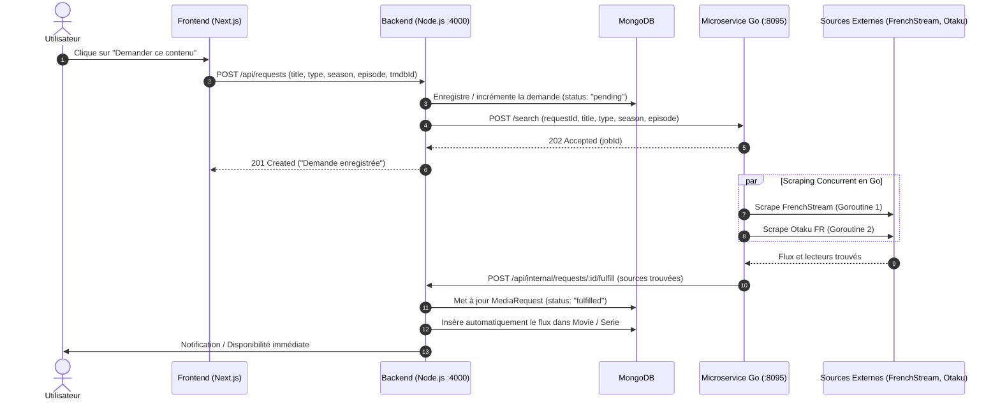

# Architecture Globale — CHILLERS Platform

Ce document présente l'architecture globale de la plateforme **CHILLERS**, incluant le frontend Next.js, le backend Node.js (API & MongoDB) et le microservice autonome de recherche profonde écrit en **Go**.

---

## 1. Vue d'Ensemble des Composants

```
┌─────────────────────────────────────────────────────────────────────────┐
│                           CHILLERS PLATFORM                             │
│                                                                         │
│   Next.js Frontend (Port 3000)                                          │
│   ├── Pages Médias (Films / Séries / Animes)                            │
│   ├── RequestModal & RequestButton (Border-radius max 2px)              │
│   └── Dashboard Admin (/admin/requests)                                 │
│        │                                                                │
│        │ Requêtes REST HTTP                                             │
│        ▼                                                                │
│   Backend Node.js Express (Port 4000)                                   │
│   ├── API REST (/api/requests, /api/movies, /api/tv, ...)               │
│   ├── MongoDB (Base de données principale)                              │
│   │   ├── Collection `mediarequests` (Demandes utilisateurs)            │
│   │   ├── Collection `movies` (Films & flux streaming)                  │
│   │   └── Collection `series` (Séries & épisodes)                       │
│   └── Dispatcher vers le microservice Go                                │
│        │                                                                │
│        │ POST http://localhost:8095/search                             │
│        ▼                                                                │
│   Microservice Go `chillers-searcher` (Port 8095)                       │
│   ├── Goroutines Fan-Out / Fan-In en parallèle                          │
│   ├── Scraper FrenchStream (Films & Séries VF/VOSTFR)                   │
│   ├── Scraper Otaku (Animes & Téléchargements Directs)                  │
│   └── Webhook Callback vers Node.js (Port 4000)                         │
└─────────────────────────────────────────────────────────────────────────┘
```

---

## 2. Diagramme de Séquence : Cycle de Vie d'une Demande



---

## 3. Répertoire des Services

- **Frontend** : `/home/ruxel/CHILLERS/src/`
- **Backend Node.js** : `/home/ruxel/CHILLERS/backend/`
- **Microservice Go** : `/home/ruxel/CHILLERS/chillers-searcher/`
- **Documentation** : `/home/ruxel/CHILLERS/doc/`
